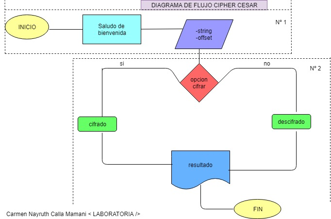
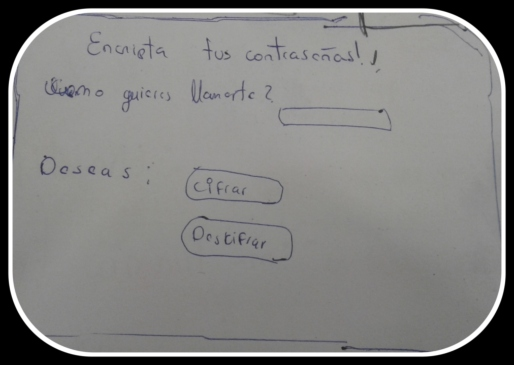
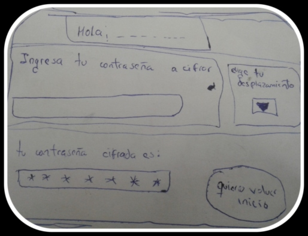
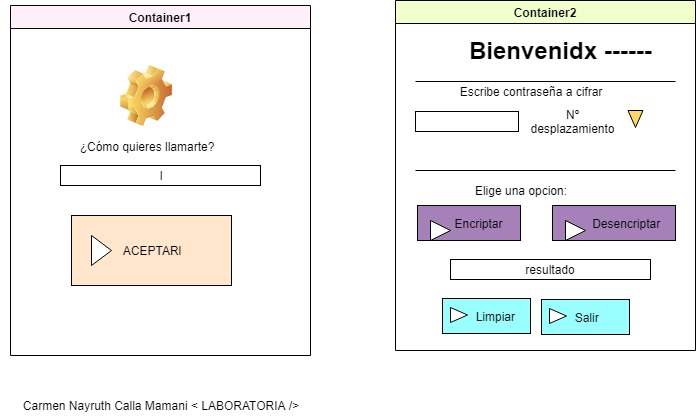
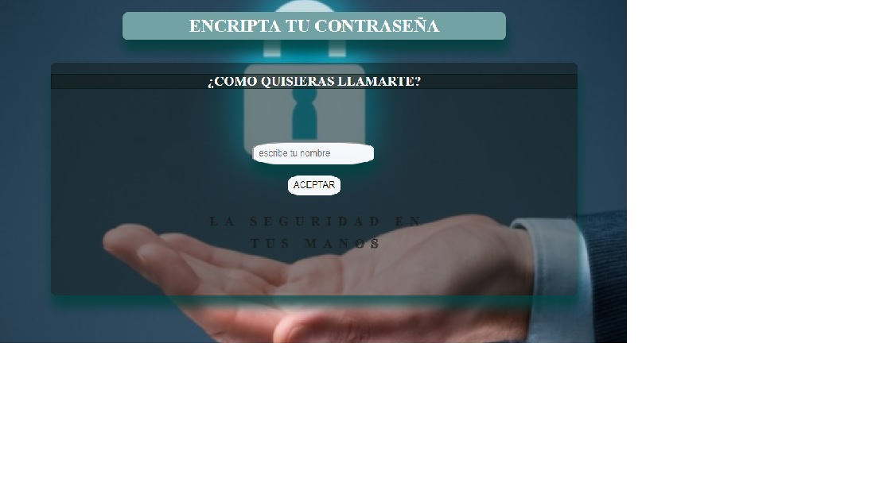
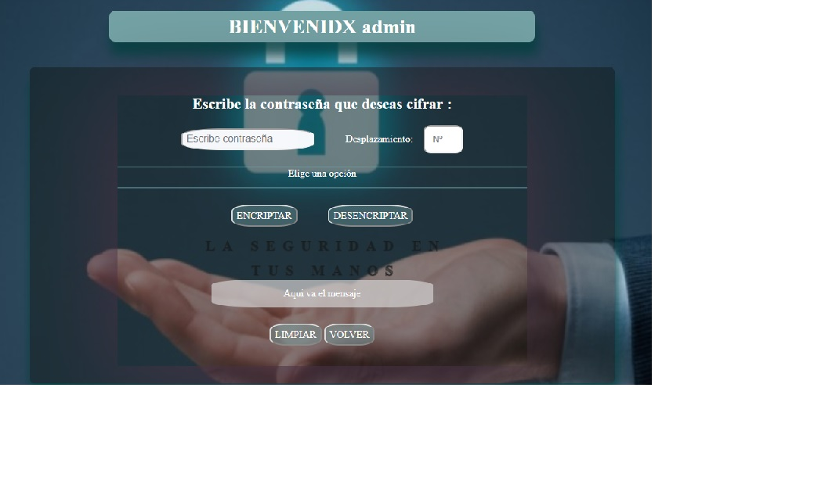
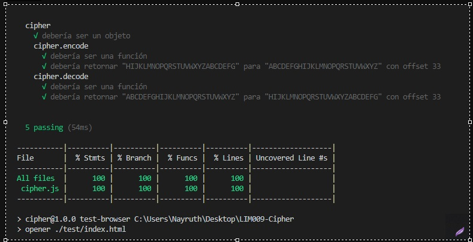
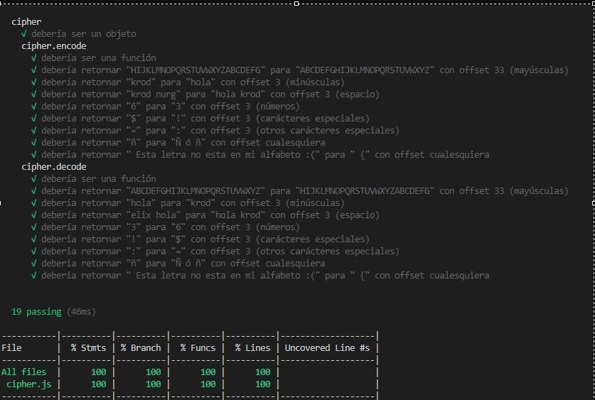
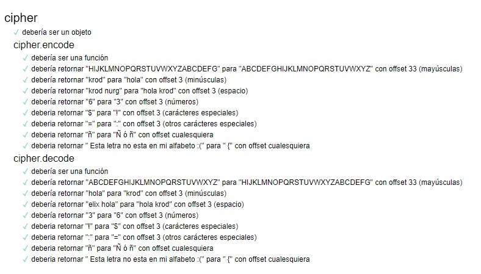

# La seguridad en tus manos (Cipher Cesar)
Ver producto desarrollado :  https://nayruthcalla.github.io/LIM009-Cipher/src/index.html
***
#### 🚀 Como obtener el codigo fuente:
1) Tener un 📝 editor de texto.
2) Si usas un sistema operativo "UNIX-like", como GNU/Linux o MacOS, ya tienes una shell (terminal) instalada por defecto (y probablemente git también 🐧). Si usas Windows puedes usar Git bash.
3) Haz tu propio 🍴 fork del repositorio.
4) ⬇️ Clona tu fork a tu computadora (copia local).
5) 📦 Instala las dependencias del proyecto con el comando npm install, siempre que ya tengas instalado node.js.
***
## Definicion del producto
- Quiénes son los principales usuarios de producto: Los principales usuarios son personas que desean guardar sus contraseñas encriptadas de todas sus cuentas como facebook, gmail, paypal, etc.
Para proteger la seguridad de su informacion y sus datos, hoy en día muchas personas guardan sus contraseña sin ningun tipo de encriptacion y esto hace posible que personas no autorizada puedan tener acceso a sus datos y poder robar información ocasionando daños económicos, sociales, etc.   

- Cuáles son los objetivos de estos usuarios en relación con tu producto: Tener seguridad al guardar sus contraseñas encriptadas para después desencriptarlas y hacer uso de sus contraseñas cuando lo necesiten, en el producto desarrollado tiene la capacidad por ahora encriptar y desencriptar solo  mayúsculas con cualquier número de desplazamiento.

- Cómo crees que el producto que estás creando está resolviendo sus problemas: El producto cumple con su objetivo de encriptar para cuando quieran guardar una contraseña de manera pública y poder desencriptar cuando quieran hacer uso de la contraseña.

## **Funcionalidades del producto desarrollado**

Para empezar tiene una bienvenda al usuario, con el nombre que el usuario quiera ingresar sea un apelativo o su nombre la idea es que se mantenga en el anonimato, para posteriormente entras al siguiente formulario.
El segundo formulario tiene como objetivo cifrar una palabra(contraseña), utilizando la fórmula basada en el "CIFRADO CESAR ", se escribe una palabra y se elige un desplazamiento.
***
Cómo utilizarlo: 
1) Ingresa nombre de usuario.
2) Escribe un contrseña en la primera casilla.
3) Ingresa un número posiciones a desplazar.
4) Hacer click en el botón "ENCRIPTAR" para cifrar la contrseña; o hacer clic en "DESENCRIPTAR" para descifrar la contrseña.
5) Hacer click en e botón "LIMPIAR" si desea limpiar la casilla de ingresar contraseña y Nº a desplazar.
6) Hacer click en el botón  "SALIR" si desea regresar al inicio.

### Cifrado César 
Cifrar significa codificar. El [cifrado César](https://en.wikipedia.org/wiki/Caesar_cipher) es uno de los primeros métodos de cifrado conocidos. El emperador romano Julio César lo usaba para enviar órdenes secretas a sus generales en los campos de batalla.

El cifrado césar es una de las técnicas más simples para cifrar un mensaje. Es un tipo de cifrado por sustitución, es decir que cada letra del texto original es reemplazada por otra que se encuentra un número fijo de posiciones (desplazamiento) más adelante en el mismo alfabeto.

Por ejemplo, si usamos un desplazamiento (_offset_) de 3 posiciones:

- La letra A se cifra como D.
- La palabra CASA se cifra como FDVD.
- Alfabeto sin cifrar: A B C D E F G H I J K L M N O P Q R S T U V W X Y Z
- Alfabeto cifrado: D E F G H I J K L M N O P Q R S T U V W X Y Z A B C

En la actualidad, todos los cifrados de sustitución simple se descifran con mucha facilidad y, aunque en la práctica no ofrecen mucha seguridad en la comunicación por sí mismos; el cifrado César sí puede formar parte de sistemas más complejos de codificación, como el cifrado Vigenère, e incluso tiene aplicación en el sistema ROT13.

## Desarrollo del diagrama de flujo:
### Primer diseño: 
En el presente diseño se obserba que antes de ingresar el texto(contraseña) y el desplazamiento(offset) se hace la condicion si desea cifrar o descifar.

### Segundo diseño (mejorado): 
En este segundo formulario se optimiza el flujo de la operacion, se vio conveniente que primero ingrese el texto(contraseña) y el desplazamiento(offset). para posterior eleccion si desea cifrar o descifrar.

***
## Diseño del Formulario:

### El primer diseño de papel 'Cipher Cesar':
En este primer diseño se realizó segun al primer diagrama de flujo planteado.
***

***
### Segundo diseño del formulario(mejorado) 'Cipher Cesar':
El presente diseño se observó que es mas optimo que el anterior, ya que el usuario ingresa la contraseña si quiere cifrar o descifrar de forma mas inmediata sin necesidad de ir a otro formulario.

***
### Formulario implementado:

***

## Descripcion técnica del producto:
El código del formulario se basa principalmente en 5 archivos, los cuales se ha codificado:

* `index.html:` Aquí se encuentra la estructura de la página y el formulario en sí.

* `cipher.js:` Aquí se encuentra el método `ENCODE` y `DECODE` con la formula sugerida por Michelle, para el Cifrado Cesar.

* `index.js:` Aquí relaciono las `id` de las cajas de textos y del boton, para relacionarlas con las variables del JavaScript. Es aquí donde señalo que el mensaje Cifrado se imprima en un cuadro de texto específico.

* `style.css:` Centro al formulario, le doy un fondo a la página y personalizo     algunas caracteristicas de la página entera.

* `cipher.spec.js:` Aquí programo los Test Unitarios. 

    * 1er test: cipher Debería ser un objeto.
    * 2do test: cipher.encode debería ser una funcion.
    * 3er test: prueba la funcionalidad de `cipher.encode`  con letras MAYUSCULAS.
    * 4to test: prueba la funcionalidad de `cipher.encode`  con letras MINUSCULAS.
    * 5to test: prueba la funcionalidad de `cipher.encode`  con SIGNOS Y NÚMEROS, ETC.
    
### Test Realizados:

### test Hacker edition:

## Recursos y temas relacionados

A continuación un video de Michelle que te lleva a través de la fórmula
matemática del Cifrado César y un par de cosas más que debes saber para
resolver este proyecto. ¡Escúchala con detenimiento y sigue sus consejos! :)

Diseño de experiencia de usuario (User Experience Design):

- Ideación
- Prototipado (sketching)
- Testeo e Iteración

Desarrollo Front-end:

* [Valores](https://lms.laboratoria.la/cohorts/lim-2019-02-bc-core-lim009/courses/javascript/01-basics/01-values-variables-and-types)
* [Tipos](https://lms.laboratoria.la/cohorts/lim-2019-02-bc-core-lim009/courses/javascript/01-basics/01-values-variables-and-types)
* [Variables](https://lms.laboratoria.la/cohorts/lim-2019-02-bc-core-lim009/courses/javascript/01-basics/02-variables)
* [Control de flujo](https://lms.laboratoria.la/cohorts/lim-2019-02-bc-core-lim009/courses/javascript/02-flow-control/00-opening)
* [Tests unitarios](https://lms.laboratoria.la/cohorts/lim-2019-02-bc-core-lim009/courses/javascript/11-testing/00-opening)
* [Aprende más sobre `charCodeAt()`](https://developer.mozilla.org/es/docs/Web/JavaScript/Referencia/Objetos_globales/String/charCodeAt)
* [Aprende más sobre `String.fromCharCode()`](https://developer.mozilla.org/es/docs/Web/JavaScript/Referencia/Objetos_globales/String/fromCharCode)
* [Aprende más sobre `ASCII`](http://conceptodefinicion.de/ascii/)
* [Documentación de NPM](https://docs.npmjs.com/)

Herramientas:

- [GitHub y GitHub Pages](https://guides.github.com/)
- [Guía de Scrum](https://www.scrumguides.org/docs/scrumguide/v1/scrum-guide-es.pdf): solamente para comenzar a entender cómo organizar tu trabajo.
[^1]: Carmen Nayruth Calla Mamani < LABORATORIA />

